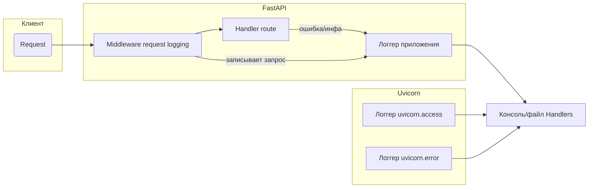
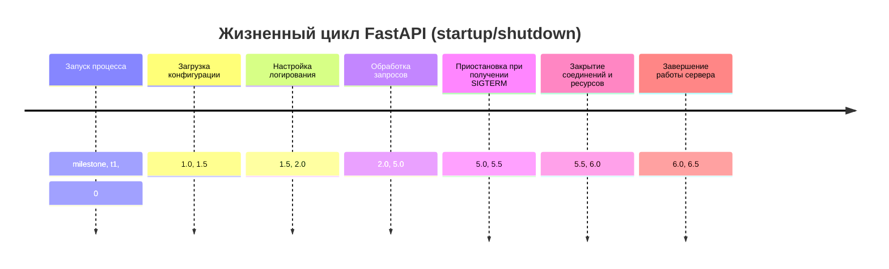

# Современное логирование в Python для FastAPI 

Основано на использовании модульной системы `logging` c конфигурацией через `dictConfig`. Важными принципами являются структурированное логирование (например, вывод JSON), использование уровней логов (`DEBUG`, `INFO` и т.д.), а также контекстные данные (идентификатор запроса, трассировка). С помощью `dictConfig` задаются основные секции: версия, форматтеры, хендлеры, логгеры, корневой логгер и отключение существующих логгеров. Для FastAPI критически важно захватить логи как самого приложения, так и UVicorn-сервера; часто объединяют логгеры `uvicorn.error` и `uvicorn.access` с логгерами приложения, чтобы иметь единый формат и уровни. Корреляция логов запросов осуществляется через `contextvars` или middleware (например, генерация уникального `request-id` на каждый запрос).  

Для продакшена рекомендуется форматировать логи в структурированный формат (JSON) и настраивать ротацию файлов. Интеграция с внешними системами сбора логов (ELK/Elastic, Graylog, Sentry, Loki) часто сводится к отправке JSON-логов через файловый источник или сетевой хендлер. Ниже приведён детальный анализ принципов логирования, разбор `dictConfig` и примеры практических конфигураций для FastAPI.  

## Принципы современного логирования  
- **Структурированное логирование.** Логи оформляют не просто как текстовые строки, а как парсируемые структуры (JSON или ключ=значение). Это упрощает их автоматический сбор и анализ. Например, можно использовать `python-json-logger` или реализовать свой `Formatter`, который форматирует `LogRecord` в JSON.  
- **Уровни логов.** Python определяет пять уровней: `DEBUG`, `INFO`, `WARNING`, `ERROR`, `CRITICAL`. Они позволяют фильтровать ненужные сообщения. В продакшене обычно устанавливают уровень `INFO` или `WARNING`, а для отладки — `DEBUG`.  
- **Контекстные данные.** В асинхронном окружении важно сохранять контекст запроса: например, уникальный `request_id`, имя пользователя или иной идентификатор. С Python 3.7 для этого удобно использовать `contextvars`, обеспечивающие «контекстно-зависимые» переменные, работающие как в потоке, так и в `async`. Эти данные могут автоматически добавляться в каждый `LogRecord` с помощью фильтров.  
- **Трассировки и ошибки.** При логировании исключений рекомендуется использовать `logger.error(..., exc_info=True)` или `logger.exception()`, чтобы получить стек вызовов. Форматтер по умолчанию выводит `%(exc_info)s`. В продакшене важно обеспечить, чтобы стек-трейсы не потерялись.  
- **Асинхронность и производительность.** Запись логов может быть заблокирована медленным выводом (например, на диск). Для высоконагруженных асинхронных сервисов применяются неблокирующие решения: `QueueHandler`/`QueueListener`, либо сторонние асинхронные хендлеры. Многопоточное логирование безопасно из коробки, но при необходимости можно организовать очередь сообщений. Также стоит обратить внимание на блокировки на файловых хендлерах и при больших нагрузках – по возможности писать в STDOUT или в отдельные потоки.  

## Конфигурация через `dictConfig`  
Схема `dictConfig` задаётся словарём с ключевыми разделами:  
- `version: 1` — версия схемы.  
- `disable_existing_loggers` — по умолчанию `True`, означает отключить настроенные ранее логгеры. Во многих случаях ставят `False` чтобы не отключать стандартные логгеры (например, `uvicorn` или сторонних библиотек).  
- `formatters` — словарь форматтеров. Каждый форматтер может указывать `format`, `datefmt` и `style`, или `()` со ссылкой на класс/фабрику. Например, стандартный `logging.Formatter` или библиотечный JSON-форматтер.  
- `handlers` — словарь хендлеров (куда писать логи). Указываются `class` (полный путь к классу хендлера), `level`, `formatter`, `filters` и специфичные параметры (имя файла, адрес сокета и т.п.). Например, `StreamHandler` для консоли, `FileHandler`/`RotatingFileHandler`, `HTTPHandler`, `DatagramHandler` и т.д.  
- `loggers` — словарь логгеров. Ключ — имя логгера (например, `"uvicorn.error"` или имя вашего модуля). Настройки включают `level`, `handlers`, `propagate` (флаг передачи родителю) и `filters`. Примеры: задать отдельные хендлеры для `uvicorn.access`, отключить его передачу (`propagate: False`), и т.д.  
- `root` — конфигурация корневого логгера: имеет уровень и список хендлеров. Например, часто задают корню обработчик в консоль/файл для всех логов приложения.  

Пример ключей конфигурации (см. официальную документацию Python):  
```python
LOGGING_CONFIG = {
    "version": 1,
    "disable_existing_loggers": False,
    "formatters": {...},
    "handlers": {...},
    "loggers": {...},
    "root": {...},
}
```  
При использовании `dictConfig`, **необязательно** прописывать каждый логгер вручную — при отсутствии записи в `loggers` используется корневой логгер. Ключ `'()'` позволяет вызывать произвольную фабрику (например, `pythonjsonlogger.JsonFormatter`).  

## Интеграция с FastAPI и Uvicorn  
FastAPI запускается чаще всего с ASGI-сервером Uvicorn. UVicorn сам создает три логгера: `uvicorn`, `uvicorn.error` (сервер и ошибки) и `uvicorn.access` (HTTP-запросы). По умолчанию их формат малоинформативен (без timestamp и полей). Частая задача — объединить вывод логов приложения и UVicorn. Для этого можно задать свой `log_config` при запуске: через CLI-флаг `--log-config path.yaml` или параметр `uvicorn.run(log_config=...)`. Пример стандартного конфига из документации Uvicorn:  
```yaml
version: 1
disable_existing_loggers: false
formatters:
  default:
    # можно использовать uvicorn.logging.DefaultFormatter
    fmt: "%(asctime)s - %(levelprefix)s %(message)s"
    datefmt: "%Y-%m-%d %H:%M:%S"
  access:
    # uvicorn.logging.AccessFormatter
    fmt: '%(asctime)s - %(levelprefix)s %(client_addr)s - "%(request_line)s" %(status_code)s'
    datefmt: "%Y-%m-%d %H:%M:%S"
handlers:
  default:
    formatter: default
    class: logging.StreamHandler
    stream: ext://sys.stderr
  access:
    formatter: access
    class: logging.StreamHandler
    stream: ext://sys.stdout
loggers:
  uvicorn:
    handlers: [default]; level: INFO; propagate: false
  uvicorn.error:
    level: INFO
  uvicorn.access:
    handlers: [access]; level: INFO; propagate: false
```
Этот пример из официального [руководства Uvicorn] показывает, как задать разные форматтеры для консольных логов сервера и доступа. После применения такого конфига Uvicorn начнет писать логи с timestamp и нужными полями, а логи приложения (если прикрепить хендлеры) будут единообразны.  

Чтобы писать логи приложения, внутри FastAPI кода обычно получают логгер модулей через `logging.getLogger(__name__)`. Но важный момент: вызовы логирования до старта приложения (при импорте модуля) могут не обрабатываться тем же конфигом. Поэтому вызовы `logging.config.dictConfig(LOGGING_CONFIG)` лучше делать либо сразу после создания `FastAPI()` (гарантируя, что они выполнены до старта сервера), либо внутри обработчика `@app.on_event("startup")`. Например:  
```python
from fastapi import FastAPI
import logging.config

app = FastAPI()
LOG_CONFIG = {...}


@app.on_event("startup")
async def configure_logging():
    logging.config.dictConfig(LOG_CONFIG)
```  
Это гарантирует, что при старте приложения сразу применяется нужная конфигурация.  

После настройки `dictConfig`, логгирование в приложении примет единый формат. Чтобы не дублировать HTTP-запросы, часто отключают стандартный логгер доступа (`uvicorn.access.disabled = True`) и вместо него пишут собственную middleware (см. ниже).  

## Middleware и логирование запросов  
UVicorn по умолчанию логирует каждый HTTP-запрос через `uvicorn.access`. Эти логи можно отключить флагом `--no-access-log`. Альтернативно, пишут **custom request logging middleware**: это даёт полную гибкость для полей (метод, путь, код, время ответа, request-id). В middleware можно измерять время обработки, генерировать или вытаскивать `request_id` (см. далее) и логировать информацию о запросе. Пример простого middleware на FastAPI:  
```python
@app.middleware("http")
async def log_request(request: Request, call_next):
    start = time.perf_counter()
    response = await call_next(request)
    duration = time.perf_counter() - start
    logger.info(
        f"{request.method} {request.url.path} status={response.status_code} time={duration:.3f}s"
    )
    return response
```  
Такой middleware выводит строки вида `GET /items 200 0.123s`. Для более детального структурированного лога в JSON можно объединить данные в словарь и передать через `extra` параметр в `logger.info()`.  

Для **корреляции** логов запроса и обработчика обычно используют уникальный ID: можно генерировать UUID и сохранять в `request.state` или `contextvars`. Существуют готовые middleware (например, `asgi-correlation-id`), которые добавляют в каждый `Request` поле `request.state.correlation_id`. Этот ID затем можно включать в каждый лог, например, через дополнительный фильтр.  

## Контекстное логирование (`contextvars`)  
Для распространения контекстной информации (например, `user_id`, `request_id`) между корутинами подходит модуль `contextvars`. Логи фильтруют и дополняют через пользовательский `logging.Filter`. В примере из Python-кулинарной книги показано, как с помощью `ContextVar` и фильтра `InjectingFilter` добавлять в каждый `LogRecord` поля `method`, `ip`, `user` и `appName`. Например:  
```python
from contextvars import ContextVar
import logging

ctx_request = ContextVar("request")
ctx_appname = ContextVar("appname")


class InjectingFilter(logging.Filter):
    def __init__(self, app_name):
        super().__init__()
        self.app_name = app_name

    def filter(self, record):
        req = ctx_request.get()
        record.method = req.method
        record.ip = req.client.host
        record.user = req.user or "anonymous"
        record.appName = ctx_appname.get()
        return True
```
В `dictConfig` можно зарегистрировать такой фильтр и применить его к хендлеру или логгеру. Тогда в форматтере можно ссылаться на `%(method)s` и другие поля. Использование `contextvars` гарантирует, что даже при одновременных запросах данные корректно разделятся между потоками и корутинами.  

## Форматы и хендлеры (таблицы)  

- **Сравнение форматов логов:**  
  | Форма | Читаемость | Парсинг | Размер лога | Применение |
  |---|---|---|---|---|
  | *Plain text* (`%(asctime)s %(levelname)s %(message)s`)| Легко читается человеком | Нужны regex/специальный парсер | Низкая гибкость структуры | Для локального дебага |
  | *JSON* (`{"ts":..., "level":..., "msg":...}`)| Человеку сложнее, но можно форматировать | Легко парсится ПО (ELK, Fluentd) | Обычно длиннее, но фиксированная схема | Централизованный сбор (ELK, Grafana) |
  | *Компактный (key=val)*| Читаемо, компактно | Можно парсить знаком `=`| Меньше, чем JSON, но нет вложенности | Быстрый лог с ключами (например, `time=... level=... msg="..."`) | Легковесный структурированный лог |

- **Хендлеры (Handlers) и их плюсы/минусы:**  

  | Handler | Куда пишет | Плюсы | Минусы |
  |---|---|---|---|
  | `StreamHandler` | Консоль (stdout/stderr) | Просто, хорошо для Docker/**контейнеров** (собирается через оператор) | Нет ротации, нужен внешний сборщик |
  | `FileHandler` | Файл | Легко настроить; можно добавить ротацию через `RotatingFileHandler` | Блокирует запись; нужен поворот / очистка; не оптимален для многопоточности |
  | `RotatingFileHandler` / `TimedRotatingFileHandler` | Файл с ротацией | Автоматическая ротация по размеру/времени | Дополнительная настройка; может блокировать запись; большие файлы в минуты ротации |
  | `QueueHandler` + `QueueListener` | Любой (как посредник) | Безопасен для многопоточности; не блокирует генерирующий код | Усложняет конфигурацию; нужен поток-слушатель |
  | `SysLogHandler` / `NTEventLogHandler` | Системный лог (syslog, Windows) | Интеграция с системой | Нужно правильно указать адрес/сокет; формат ограничен |
  | `SocketHandler` / `DatagramHandler` | UDP/TCP сокет (можно Graylog) | Отправка по сети (например, в Graylog через GELF) | Сетевые задержки; пакеты могут теряться; нужна настройка сервера |
  | `HTTPHandler` | HTTP-запросы | Прямой POST логов на HTTP-сервис | Может блокировать/тормозить; нужен эндпоинт |
  | `SMTPHandler` | Email | Шлёт письма об ошибках | Очень медленный; рискует спамить; использовать с осторожностью |
  | Интегрированные (SentrySDK, Loki Handler) | Специализированные (Sentry, Loki) | Пакеты с поддержкой, трекинг ошибок | Требуют сторонних библиотек; могут отправлять логи асинхронно |

- **Чек-лист для продакшн-конфигурации:**  

  1. Установить `disable_existing_loggers: False` (обычно рекомендуют не отключать существующие).  
  2. Логи **всех** компонентов (FastAPI, uvicorn, сторонних библиотек) должны попадать в обработчики; настроить `handlers` и `propagate` так, чтобы ничего не терялось.  
  3. Форматировать логи структурированно (JSON или key=value) для удобства централизованного сбора.  
  4. Обеспечить ротацию логов (RotatingFileHandler) или логирование в stdout для управления (например, Docker/Fluentd).  
  5. Добавить поля контекста: `request_id`, `user`, `method`, `path`, `status` и т.д., через фильтры или middleware.  
  6. Логировать ошибки с полным стеком (`exc_info=True` или `logger.exception()`).  
  7. Включить логи уровня `ERROR/CRITICAL` в отдельный канал (например, файл `errors.log`).  
  8. Минимизировать блокирующие операции в коде логирования (использовать очереди, асинхронные хендлеры).  
  9. При интеграции с ELK/Graylog/Loki обеспечить совместимый формат (обычно JSON).  
  10. Отключить дебаг-логи в проде (уровень `INFO` или выше), либо динамически изменять уровни через `--log-level`.  

## Примеры конфигураций `dictConfig`  

**1. Простой конфиг (вывод в консоль).** Минимальная настройка, подходит для разработки:  
```yaml
version: 1
disable_existing_loggers: False
formatters:
  simple:
    format: "%(asctime)s [%(levelname)s] %(name)s: %(message)s"
handlers:
  console:
    class: logging.StreamHandler
    level: DEBUG
    formatter: simple
    stream: ext://sys.stdout
loggers:
  uvicorn.error:
    level: INFO
    handlers: [console]
    propagate: no
  uvicorn.access:
    level: INFO
    handlers: [console]
    propagate: no
  myapp:          # ваш основный логгер
    level: DEBUG
    handlers: [console]
    propagate: no
root:
  level: INFO
  handlers: [console]
```
Этот конфиг направляет все логи в консоль с форматированием `"[TIME] [LEVEL] LOGGER: MESSAGE"`. Здесь `myapp` — логгер вашего приложения; можно использовать `logging.getLogger(__name__)`.  

**2. Продакшн-конфиг с JSON и ELK.** Логи пишутся в файл в формате JSON для сбора (через Filebeat/Logstash):  
```yaml
version: 1
disable_existing_loggers: False
formatters:
  json:
    "()": pythonjsonlogger.jsonlogger.JsonFormatter
    fmt: "%(asctime)s %(levelname)s %(name)s %(message)s"
handlers:
  file:
    class: logging.handlers.RotatingFileHandler
    level: INFO
    formatter: json
    filename: logs/app.json
    mode: a
    maxBytes: 10485760    # 10 MB
    backupCount: 5
loggers:
  uvicorn.error:
    level: INFO; handlers: [file]; propagate: no
  uvicorn.access:
    level: INFO; handlers: [file]; propagate: no
  myapp:
    level: INFO; handlers: [file]; propagate: no
root:
  level: INFO
  handlers: [file]
```
Здесь используется `python-json-logger` (установить `pip install python-json-logger`). Логгер `uvicorn.access` писать в файл можно, либо отключить его, если middleware покрывает запросы. Файл будет ротацироваться при 10 MB, сохраняя 5 архивов. Этим конфигом все логи (в т.ч. из uvicorn) попадают в один JSON-файл, подходящий для ElasticSearch.  

**3. Асинхронный конфиг с `contextvars` и `request_id`.** Настраивает контекстный фильтр и вывод в консоль:  
```yaml
version: 1
disable_existing_loggers: False
filters:
  add_context:
    '()': myproject.logging.ContextFilter   # кастомный фильтр, использующий contextvars
formatters:
  with_request:
    format: '%(asctime)s [%(request_id)s] %(levelname)s %(name)s: %(message)s'
handlers:
  console:
    class: logging.StreamHandler
    level: DEBUG
    formatter: with_request
    filters: [add_context]
    stream: ext://sys.stdout
loggers:
  uvicorn.error:
    level: INFO; handlers: [console]; propagate: no
  uvicorn.access:
    level: INFO; handlers: [console]; propagate: no
  myapp:
    level: DEBUG; handlers: [console]; propagate: no
root:
  level: DEBUG; handlers: [console]
```
Здесь предполагается, что в коде определён фильтр `ContextFilter`, который извлекает из `contextvars` `request_id` и добавляет его в `record` (как `record.request_id`). Форматтер выводит поле `%(request_id)s`. Такой подход гарантирует, что каждый лог содержит идентификатор запроса.  

## Примеры кода и проверки  

**Подключение конфигурации в FastAPI:** В файле `main.py` или в отдельном конфиге можно сразу применить `dictConfig`:  
```python
import logging.config
from fastapi import FastAPI

LOG_CONFIG = {...}  # как в примерах выше
app = FastAPI()

# Настраиваем логирование до старта
logging.config.dictConfig(LOG_CONFIG)


@app.get("/")
async def hello():
    logging.getLogger("myapp").info("Hello from endpoint!")
    return {"msg": "ok"}
```
Или так, чтобы точно после запуска:  
```python
@app.on_event("startup")
async def startup_logging():
    logging.config.dictConfig(LOG_CONFIG)
    logging.getLogger("myapp").info("Application startup complete")
```

**Тестирование логов:** Можно запустить приложение и убедиться, что при запросах приходят строки в нужном формате. Простой тест:  
```bash
$ curl http://localhost:8000/
$ cat logs/app.json  # если включено логирование в файл
```
Убедитесь, что в выводе присутствуют ваши сообщения и, при структуре JSON, корректные поля (`request_id`, `status_code` и т.д.). Например, при асинхронном конфигах должны отображаться динамически сгенерированные `request_id`.  

## Визуализация  



## Источники  
Рекомендации основаны на официальной документации Python [`logging.config.dictConfig()`] и FastAPI/UVicorn, а также на практических гайдах по логированию. В частности, использованы примеры из «Logging Cookbook» Python для `contextvars` и структурированных логов, статья по структурированному FastAPI-логированию и советы по настройке в продакшене. Эти материалы отражают лучшие практики современного логирования и использования `dictConfig` в асинхронных приложениях.